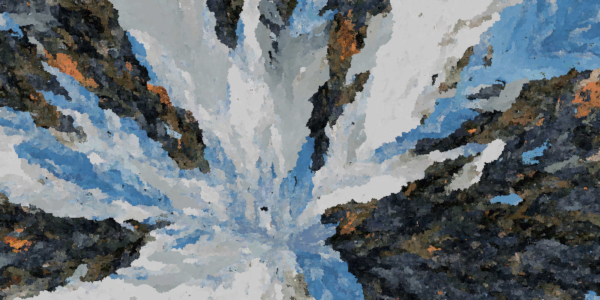

# Markov Painting

> Build Markov Chain from an image to generate beautiful flood-fill art


## Table of Contents

 + [Description](#description)
 + [Install](#install)
 + [Usage](#usage)
 + [API](#api)
 + [Contributing](#contributing)
 + [License](#license)


## Description

A Markov chain is a system that experiences transitions from one state to another, according to certain probabilistic rules. You can find a simple introduction on [setosa.io](http://setosa.io/ev/markov-chains/), and a more in-depth definition on [brilliant.org](https://brilliant.org/wiki/markov-chains/).

This module is able to build a Markov chain by analyzing the colors transitions of any input images. After the Markov chain is created, the library can produce beautiful images which have statistically identical color transitions.

**Input**


**Output**




## Install

You can install the module with [npm](https://www.npmjs.com/)
```sh
npm install markov-painting
```

You can import the module with a CDN like [unpkg](https://unpkg.com/)
```html
<script type="text/javascript" src="https://unpkg.com/markov-painting@latest"></script>
```

You can clone the repository & include the `markov-painting.js` file in your project:
```sh
git clone https://github.com/ogus/markov-painting.git
```


## Usage

Instantiate a new MarkovPainting, feed it an image, and generate as many image as you want
```js
// Create a new object
var markov = new MarkovPaintinge();

// Create a new ImageData
var image = new Image(...);
var canvas = document.createElement("canvas");
var context = canvas.getContext("2d");
context.drawImage(image, 0, 0);
var imageData = context.getImageData(0, 0, image.width, image.height);

// Build the Markov chain with ImageData stats
markov.feedImageData(imageData);

// Create a new ImageData
var markovData = mkvChain.createImageData(800, 600);
```


## API

### Instanciation

#### `new MarkovPaintinge()`

Create a new `Object` that contains a Markov Chain model.

__Property__

+ compression: THe compression level used to store colors in the model

### Build a Markov chain

#### `MarkovPaintinge.feedImageData(imageData)`

Update the model of the Markov Chain with the color information of the input `ImageData` object

#### `MarkovPaintinge.feedColorMatrix(colorMatrix)`

Update the model of the Markov Chain with the color information of the input 2D `Array` containing colors as `{r, g, b}` values

#### `MarkovPaintinge.addColorTransition(color1, color2)`

Update the Markov chain with a single transition from color1 to color2, both defined as `{r, g, b}` values

### Generate an image

#### `MarkovPaintinge.createImageData(width, height)`

Create an image as a `Uint8ClampedArray`, that can be used on a Canvas.

#### `MarkovPaintinge.getNextColor(color)`

Return a new `{r, g, b}` color that is adjacent to the input `{r, g, b}` color, based on the Markov chain transition probability

#### `MarkovPaintinge.getRandomColor()`

Return a random `{r, g, b}` color that exist in the Markov chain


## Contributing

If you find a bug, a typo, or a missing feature, do not hesitate to contribute to this repository !


## License

This project is licensed under the MIT License - see [LICENSE](LICENSE) for more details
